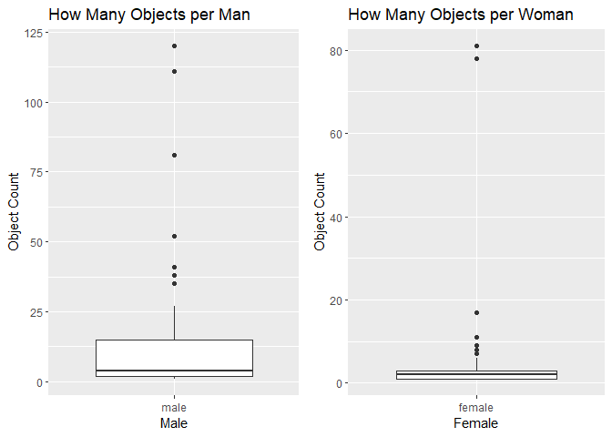

Project 2
================
Jasmine Gallaway
10-14-2023

## Beginner Friendly Havard Art Museum API Query

So you like art. You like the art that is in the Harvard Art Museum. You
want to know the numbers and data behind the art in the museum. The
Harvard Art Museum API is the resource for you. This vignette is the
resource to make your API data dive easier!

There’s many parts to obtaining the data from an API. Typically a URL
must be made to call the API, the returned data will need to be parsed
into a readable format, and then sort and clean the data to uncover your
perfect dataset. For coding beginners this may seem like a daunting
task; however, this vignette will guide you through the steps- starting
with what packages you need downloaded.

### Necessary Libraries

This whole vignette was accomplished with a few installed packages.
Those packages are:

- `httr` to call the API  
- `jsonlite` to make the JSON API output more readable in R  
- `dplyr` to manipulate data  
- `tidyverse` to transform and present data  
- `ggplot2` to make graphics  
- `cowplot` to put plots on a grid for visual comparison

## How to Query the Harvard Art API

After reading in those libraries the next step is to code your query! In
my experience, making sure the syntax on the API call is correct can be
a lot when starting out. Good thing that the Harvard Art Museum API is
very beginner friendly! There is plenty of good documentation to explain
the database so figuring out what resources or filters to use isn’t so
difficult. To make the process more simple I have created multiple
functions to go through the call, parsing, and filtering of data from an
API. So after you sign up for an API key on the Harvard Art Museum API
website, feel free to try out these helpful functions.

### Homemade Functions

`composing_URL`

In this function the inputs are “resource”, “filtering”, and “key”. All
three of these inputs must to be entered as a character string with
quotes around the option. `composing_URL` will return one of two base
URL formats to access the API. These base URLs can be made unique with
the multitude of options for the arguments.

``` r
#This function will return the URL to use to access the correct API endpoint
composing_URL <- function(resource, key, filtering = "na"){
  my_URL <- if(filtering != "na"){
    paste0("https://api.harvardartmuseums.org/",resource,"?q=",filtering,"&apikey=",key)}
    else{
    paste0("https://api.harvardartmuseums.org/",resource,"&apikey=",key)
    }
  return(my_URL)
}
```

`more_pages`

In case you need more data for your uses, I created a pagination
function to help ease the process of gathering more information from the
Harvard Art Museum API. This API does have a limit of 10,000 entries per
API key so be wise in how you are grabbing data. The input includes your
base URL, where you want to set your limit at (the default is 100 so you
don’t query all in one spot, remember 10,000 is the limit set by the API
and you cannot change that), and how many items you would like to see on
each page.

``` r
#This is what my best attempt at the pagination function would be. In my attempts to merge it with my other functions I decided to simply add a &size= to the URL calls so that I could get enough data. I changed the size of the functions that I use in my EDA to higher numbers so that I could get the graphs that I wanted 
#A while loop is a good fit to watch your limits. It only works while a condition is true.
more_pages <- function(my_URL, limit = 100, items_per_page = 10){
  #Setting up all other variables for this function  
  #Setting this at zero for when you begin to query  
  items_received <- 0  
  
  #This variable is telling R what page we are on  
  on_page <- 1  
  
  #Here is the conditional while loop  
  while (items_received < limit){
  #Creating another with page number in the URL  
  page_URL <- paste0(my_URL, "?page=", on_page)
   
  
  #Getting data from the URL  
  response <- httr::GET(page_URL)  
  
  #Saving the items on the page  
  items <- httr::content(response)[["items"]]  
  
  #Adding the number of new items to the total items received so far
  items_received <- items_received + length(items)  
  
  #Tracking what page of data it is on  
  on_page <- on_page + 1  
  }
  
  #Letting the user know how many items they have called for from the API  
  return(items_received)
}
```

`object_info`

If you’re a little lost in where to start your search I have also made
some other functions to query more specific endpoints of the Harvard Art
Museum API. `object_info` is one of the resources in this API is
“object” which gives more information about the artwork, artist, online
view count, and even what medium was used. The purpose of this function
is to access the object ID, what century it is from, what culture it is
from, and the total online page views. The object ID is included in this
tibble in case you would like to remember a specific object to call for
later on. The only input is your personal API key and the end result
should be a table of object information.

``` r
#Calling the API for object, information  
object_info <- function(key){
  #Providing the base URL  
  base_URL <- "https://api.harvardartmuseums.org/object?apikey="  

  #Pasting together the API
  object_URL <- paste0(base_URL, key,"&size=200")  
  
  #Pulling data from the API
  my_data <- httr::GET(object_URL)  

  #Turning data into a table that is readable in R
  readable_table <- fromJSON(rawToChar(my_data$content))  

  #Picking out the objectid, century, culture, and totalpageviews
  selected_table <- select(readable_table$records, objectid, century, culture, totalpageviews)

  #Printing out the table a little nicer as a tibble  
  informational_table <- as_tibble(selected_table)  
  
  #Remove rows with NA  
  informational_table <- na.omit(informational_table)  

  #Returning the informational table }
  print(informational_table)
}
```

`cultured_objects`

This function is to call to the API for more information about the
objects, but only selecting a particular culture of objects to look at.
Some options that the Harvard Art Museum API has is American, Coptic,
Byzantine, and Japanese. The only necessary input is your API key and
the culture name which should be specified in quotations.

``` r
#Calling the API for objects from a specific culture  
cultured_objects <- function(key, culture){
  #Providing the base URL  
  base_URL <- "https://api.harvardartmuseums.org/object?apikey="  
 
  #Pasting together the API
  cult_obj_URL <- paste0(base_URL,key,"&q=culture:",culture,"&size=50")  
  
  #Pulling data from the API
  my_data <- httr::GET(cult_obj_URL)  

  #Turning data into a table that is readable in R
  readable_table <- fromJSON(rawToChar(my_data$content))  

  #Picking out the objectid, century, culture to assure you received the correct information, and totalpageviews
  selected_table <- select(readable_table$records, objectid, century, culture, totalpageviews)

  #Printing out the table a little nicer as a tibble  
  informational_table <- as_tibble(selected_table)  
  
  #Remove rows with NA  
  informational_table <- na.omit(informational_table)  

  #Returning the informational table 
  print(informational_table)  
}
```

`century_objects`

Maybe you’re more of a history buff, and you would like to only learn
about objects from your favorite century. `century_objects` function can
help you out! The input need for this function is your API key and which
century you would like to look at. Century should be in the format of:
“14th century BCE” or “6th millennium BCE”.

``` r
#Calling the API for objects from different centuries  
century_objects <- function(key, century){
  #Providing the base URL  
  base_URL <- "https://api.harvardartmuseums.org/object?apikey="  
  
  #Pasting together the API
  cent_obj_URL <- paste0(base_URL,key,"&q=century:",century,"&size=50")  
  
  #Pulling data from the API
  my_data <- httr::GET(cent_obj_URL)  

  #Turning this into a table that is readable in R
  readable_table <- fromJSON(rawToChar(my_data$content))  

  #Picking out the objectid, century to assure correct information is received, culture, and totalpageviews 
  selected_table <- select(readable_table$records, objectid, century, culture, totalpageviews)

  #Printing out the table a little nicer as a tibble  
  informational_table <- as_tibble(selected_table)  
  
  #Remove rows with NA  
  informational_table <- na.omit(informational_table)

  #Returning the informational table 
  print(informational_table)  
}
```

`find_people`

Are you more of a people person? If you would like to know more about
the people behind the work `find_people` can introduce you to some
information. In this function the person ID (like object ID this can be
used to call information about a specific person later), binary gender,
culture, object count (how many pieces from them), and the date they
began to show the work are returned in a neat little table as a result.

``` r
#Calling the API for people who have had something displayed at the Harvard Art Museum  
find_people <- function(key){
    #Providing the base URL  
  base_URL <- "https://api.harvardartmuseums.org/person?apikey="  
  
  #Pasting together the API
  person_URL <- paste0(base_URL, key,"&size=200")  
  
  #Pulling data from the API
  my_data <- httr::GET(person_URL)  
  
  #Turning this into a table that is readable in R
  readable_table <- fromJSON(rawToChar(my_data$content))  

  #Picking out the personid, displayname, gender, objectcount, and datebegin  
  selected_table <- select(readable_table$records, personid, displayname, gender, objectcount, datebegin)

  #Printing out the table a little nicer as a tibble  
  informational_table <- as_tibble(selected_table)

  #Remove rows with NA  
  informational_table <- na.omit(informational_table)  
  
  #Remove the rows with subset() to clean the data some 
  pers_tbl <- subset(informational_table, (gender != "unknown" & objectcount != 0 & datebegin != 0))  
  
  #Returning the good table 
  return(pers_tbl)  
}
```

`date_people`

This function allows the user to change the years that the `datebegin`
looks at. In this function the user can specify `before` or `after` a
`year_desired` so that the records of people will reflect this
modification.

``` r
#Calling the API for people who have had something displayed at the Harvard Art Museum  
date_people <- function(key, when, year_desired){
  #Providing the base URL  
  base_URL <- "https://api.harvardartmuseums.org/person?apikey="  
  
  #Pasting together the API
  date_pers_URL <- paste0(base_URL, key,"&",when,"=",year_desired,"&size=50")  
  
  #Pulling data from the API
  my_data <- httr::GET(date_pers_URL)  
  
  #Turning this into a table that is readable in R
  readable_table <- fromJSON(rawToChar(my_data$content))  

  #Picking out the personid, displayname, gender, objectcount, and datebegin  
  selected_table <- select(readable_table$records, personid, displayname, gender, objectcount, datebegin)

  #Printing out the table a little nicer as a tibble  
  informational_table <- as_tibble(selected_table)

  #Remove rows with NA  
  informational_table <- na.omit(informational_table)  
  
  #Remove the rows with subset() to clean the data some 
  date_pers_tbl <- subset(informational_table, (gender != "unknown" & objectcount != 0 & datebegin != 0))  
  
  #Returning the good table 
  return(date_pers_tbl)  
}
```

`person_gender`

My personal favorite would be this `person_gender` function. I could see
a lot of good data analysis coming from comparing the male to female
records in this binary gender option. The input here will be your API
key and then selecting male or female to retrun all the male data or all
the female data.

``` r
#Calling the API for people based on a binary gender model
person_gender <- function(key, gender){
    #Providing the base URL  
  base_URL <- "https://api.harvardartmuseums.org/person?apikey="  
  
  #Pasting together the API
  gen_pers_URL <- paste0(base_URL,key,"&q=gender:",gender,"&size=200")  
  
  #Pulling data from the API
  my_data <- httr::GET(gen_pers_URL)  

  #Turning this into a table that is readable in R
  readable_table <- fromJSON(rawToChar(my_data$content))  
 
  #Picking out the personid, displayname, gender (to assure correctness), objectcount, and datebegin  
  selected_table <- select(readable_table$records, personid, displayname, gender, objectcount, datebegin)

  #Printing out the table a little nicer as a tibble  
  informational_table <- as_tibble(selected_table)

  #Remove the rows with subset() to clean the data some 
  gen_pers_tbl <- subset(informational_table, (gender != "unknown" & objectcount != 0 & datebegin != 0))  
  
  #Returning the good table 
  return(gen_pers_tbl)  
}
```

## Go Wild for Expoloratory Data Analysis (EDA)

EDA is the most fun part of the API query journey! Now you can take
whatever data you chose and figure out the different relationships
between your specified options. Here I am going to analyze the
difference between male and female records. I want to see which of these
two genders appears more throughout time and how much each has. Commonly
today we hear how men take up most of different spaces and I want to see
if that applies to art at the museum as well. Do men hold the most space
at museums? Is there any time when there were more obejcts from women
than men? What is the average amount of object per man or woman?

``` r
#Had to make one specifically for the first 200 female and 200 males entries separately because there is so much data, but each user has a limit of 10,000 and I am not trying to hit that. 
#Using my person_gender function to pull in data for this numerical summary  
fem_pers_tbl <- person_gender("1d505e26-5d36-4674-a35b-c40cab886778", "female")  

#Doing the same for men  
mal_pers_tbl <- person_gender("1d505e26-5d36-4674-a35b-c40cab886778", "male")

#Selecting the specific columns I want to look at so summarise() does not clutter the table
fem_gen_summary <- fem_pers_tbl %>% 
              group_by(gender) %>% 
              summarise(mean = mean(objectcount),
                       sd = sd(objectcount),
                       min = min(objectcount),
                       max = max(objectcount),
                       IQR = IQR(objectcount))  

#Doing the same for the male statistics
mal_gen_summary <- mal_pers_tbl %>% 
              group_by(gender) %>% 
              summarise(mean = mean(objectcount),
                       sd = sd(objectcount),
                       min = min(objectcount),
                       max = max(objectcount),
                       IQR = IQR(objectcount))  

#Printing the summaries table  
print(fem_gen_summary)  
```

    ## # A tibble: 1 × 6
    ##   gender  mean    sd   min   max   IQR
    ##   <chr>  <dbl> <dbl> <int> <int> <dbl>
    ## 1 female  4.78  12.8     1    81     2

``` r
#Printing the male summaries table  
print(mal_gen_summary)  
```

    ## # A tibble: 1 × 6
    ##   gender  mean    sd   min   max   IQR
    ##   <chr>  <dbl> <dbl> <int> <int> <dbl>
    ## 1 male    12.5  21.6     1   120    13

``` r
#Making a boxplot of the summary statistics for a more visual look  
mal_gen_plot1 <- ggplot(data = mal_pers_tbl, aes(x = gender, y = objectcount)) +
         geom_boxplot() + 
         labs(title = "How Many Objects per Man", x = "Male", y = "Object Count")

#Making the womens objectcount summaries boxplot  
fem_gen_plot1 <-ggplot(data = fem_pers_tbl, aes(x = gender, y = objectcount)) +
         geom_boxplot() + 
         labs(title = "How Many Objects per Woman", x = "Female", y = "Object Count")  

#Plotting the two plots side by side for better visual  
plot_grid(mal_gen_plot1, fem_gen_plot1, ncol = 2)
```

<!-- -->

These two boxplot show an interesting dynamic. Here we can see that the
spread of how many object each male record has is larger than that of
the female records. These numbers are further broken down in the
numerical summaries of women (`fem_gen_summary`) and men
(`mal_gen_summary`). In those numcerical summary tables women have on
average a mean of about 4 objects and a maximum of 81 objects. In the
men’s records, men have an average of about 12 objects and a maximum of
120 objects. These results are based off of about 200 of the entries for
men and women each. To draw conclusions off of this small sample size, I
would say that men take up more space than women in the Harvard Art
Museum. Now these results do not address timing yet, but the sheer
difference in average objects per man lead me to believe that men in
general hold more space in the museum.

Next I want to address the time of when either gender is more popular. I
made two contingency tables, one for each of the binary genders. In
these tables I compared the frequency of the gender to each year
recorded for `datebegin`. In the tables I expect to be abel to compare
which year(s) were more popular for men or women based on the
frequencies.

``` r
#Using the person_gender function to pull data for the contingency table for both men and women  
fem_pers_tbl <- person_gender("1d505e26-5d36-4674-a35b-c40cab886778", "female")  

#Doing the same for men  
mal_pers_tbl <- person_gender("1d505e26-5d36-4674-a35b-c40cab886778", "male")

#Creating a contingency table for women and datebegin  
fem_con_tbl_1 <- table(fem_pers_tbl$gender, 
                  fem_pers_tbl$datebegin)  

#Creating a contingency table for men and datebegin  
mal_con_tbl_2 <- table(mal_pers_tbl$gender, 
                  mal_pers_tbl$datebegin)  

#Printing out the contingency table for women   
print(fem_con_tbl_1)  
```

    ##         
    ##          1747 1820 1864 1876 1889 1891 1898 1900 1903 1907 1908 1912 1916 1922
    ##   female    1    1    1    1    1    1    2    8    1    1    2    1    1    1
    ##         
    ##          1925 1926 1929 1930 1931 1933 1934 1935 1936 1937 1940 1941 1942 1943
    ##   female    3    2    1    2    2    1    2    2    1    1    1    6    3    1
    ##         
    ##          1944 1945 1946 1950 1951 1952 1953 1954 1955 1957 1958 1960 1965 1990
    ##   female    3    3    1    1    3    3    1    1    1    1    1    1    1    1
    ##         
    ##          1993
    ##   female    1

``` r
#Printing out the contingency table for men   
print(mal_con_tbl_2)  
```

    ##       
    ##        -100 1500 1743 1767 1800 1805 1809 1812 1819 1822 1830 1841 1843 1848
    ##   male    1    2    1    1    1    1    1    2    1    2    1    1    1    2
    ##       
    ##        1858 1865 1872 1874 1880 1883 1887 1894 1906 1912 1914 1920 1926 1928
    ##   male    1    1    1    2    1    3    2    1    1    1    1    1    1    1
    ##       
    ##        1931 1932 1934 1935 1938 1939 1940 1941 1942 1943 1944 1945 1946 1947
    ##   male    2    2    2    2    2    1    1    1    1    2    2    1    1    3
    ##       
    ##        1948 1949 1950 1951 1952 1953 1955 1956 1964 1966 1968 1969 1970 1976
    ##   male    2    2    1    1    1    1    2    1    1    2    1    1    1    1
    ##       
    ##        1978 1979
    ##   male    1    1

In the `mal_con_tbl_2` the most popular `datebegin` is in 1883 and 1947
with both of these years having a total of 3 men beginning then. In the
`fem_con_tbl_1` table women had the most starts in 1900, and 1941, with
a total of 8 and 6, respectively. This is very interesting that women
had more concentrated starts than men did. I would be very intrigued to
figure out which records of women started during these time and what
made this occur. These contingency tables are not the best as entries
are removed due to NA values in other columns. Not all of the years are
listed on both contingency tables so it is difficult to officially
compare and draw conclusions. The only year with a high start date is in
1941. In 1941 there were 6 women who started, compared to 1 man. Further
data analysis is required to see which binary gender is more popular
throughout each year.

The next

``` r
#Using the object_info function to pull data for the contingency table  
obj_tbl <- object_info("1d505e26-5d36-4674-a35b-c40cab886778")  
```

    ## # A tibble: 99 × 4
    ##    objectid century      culture  totalpageviews
    ##       <int> <chr>        <chr>             <int>
    ##  1    39114 20th century American              0
    ##  2    39115 20th century American              0
    ##  3    39116 20th century American              3
    ##  4    39117 20th century American              0
    ##  5    39118 20th century American              2
    ##  6    39119 20th century American              5
    ##  7    39120 20th century German                4
    ##  8    39121 20th century German                3
    ##  9    39122 20th century American              5
    ## 10    39123 20th century American             10
    ## # ℹ 89 more rows

``` r
#Creating a contingency table for culture and century  
con_tbl_2 <- table(obj_tbl$culture, 
                  obj_tbl$century)  
#Printing out the contingency table 
print(con_tbl_2)
```

    ##           
    ##            20th century
    ##   American           31
    ##   German             68

``` r
#Using person_gender() to pull only female records first
pers_tbl <- find_people("1d505e26-5d36-4674-a35b-c40cab886778")  

#Making a line plot off of the objectcount over time for each gender
obj_cnt_plot2 <- ggplot(pers_tbl, aes(x = datebegin, y = objectcount, color = gender)) + 
            geom_line()
```

``` r
#Pull data from object API endpoint
cent_views_tbl <- object_info("1d505e26-5d36-4674-a35b-c40cab886778")  
```

    ## # A tibble: 100 × 4
    ##    objectid century      culture  totalpageviews
    ##       <int> <chr>        <chr>             <int>
    ##  1    54767 20th century American              2
    ##  2    54768 20th century American              2
    ##  3    54769 20th century American              3
    ##  4    54770 20th century American              1
    ##  5    54771 20th century American              6
    ##  6    54772 20th century American              1
    ##  7    54773 20th century American              4
    ##  8    54774 20th century American              1
    ##  9    54775 20th century American              3
    ## 10    54776 20th century American              7
    ## # ℹ 90 more rows

``` r
#Make a scatterplot of the century versus the totalpageviews
cent_views_plot3 <- ggplot(cent_views_tbl, aes(x = century, y = totalpageviews)) + 
                             geom_histogram()
```

``` r
#Pull data from the object API endpoint 
cult_views_tbl <- object_info("1d505e26-5d36-4674-a35b-c40cab886778")  
```

    ## # A tibble: 99 × 4
    ##    objectid century      culture  totalpageviews
    ##       <int> <chr>        <chr>             <int>
    ##  1    39114 20th century American              0
    ##  2    39115 20th century American              0
    ##  3    39116 20th century American              3
    ##  4    39117 20th century American              0
    ##  5    39118 20th century American              2
    ##  6    39119 20th century American              5
    ##  7    39120 20th century German                4
    ##  8    39121 20th century German                3
    ##  9    39122 20th century American              5
    ## 10    39123 20th century American             10
    ## # ℹ 89 more rows

``` r
#Make a histogram for the totalpageviews per culture  
cult_views_plot4 <- ggplot(cult_views_tbl, aes(x = culture, y = totalpageviews)) + 
                              geom_jitter()
```

``` r
#Pull data from the object API endpoint 
cult_views_tbl2 <- object_info("1d505e26-5d36-4674-a35b-c40cab886778")  
```

    ## # A tibble: 100 × 4
    ##    objectid century      culture  totalpageviews
    ##       <int> <chr>        <chr>             <int>
    ##  1    54767 20th century American              2
    ##  2    54768 20th century American              2
    ##  3    54769 20th century American              3
    ##  4    54770 20th century American              1
    ##  5    54771 20th century American              6
    ##  6    54772 20th century American              1
    ##  7    54773 20th century American              4
    ##  8    54774 20th century American              1
    ##  9    54775 20th century American              3
    ## 10    54776 20th century American              7
    ## # ℹ 90 more rows

``` r
#Make a dotplot to demonstrate the totalpageviews per culture  
cult_views_plot5 <- ggplot(cult_views_tbl2, aes(x = culture, y = totalpageviews)) + 
                              geom_dotplot()  
```
